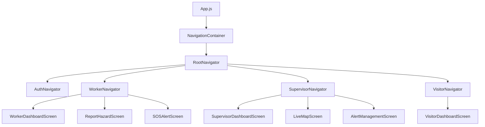
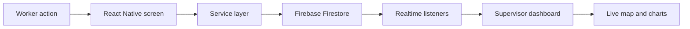

# MineShield Architecture

## Overview

MineShield is a cross-platform React Native application built with Expo and backed by Firebase.
It is designed for mining-site safety operations across worker, supervisor, and visitor flows.

The app focuses on:

- Hazard reporting
- Real-time safety maps
- Role-based navigation
- Notifications and alerts
- Offline queueing and sync recovery

## System Layers

### UI Layer

The UI layer is responsible for:

- Screens
- Shared components
- Navigation
- Theme and layout
- User interaction and feedback

This layer lives mainly in:

- `src/screens`
- `src/components`
- `src/navigation`
- `src/styles`

### Service Layer

The service layer contains application logic that talks to Firebase or other device APIs.

It handles:

- Authentication
- Firestore reads and writes
- Storage uploads
- Offline queue sync
- Location and sensor integration
- Notification creation and retrieval

This layer lives mainly in:

- `src/services`
- `src/hooks`

### Data Layer

The data layer is the Firebase-backed source of truth for the app.

It includes:

- Firestore collections for users, hazards, alerts, zones, and visitor sessions
- Firebase Authentication sessions
- Storage for media and uploads
- Security rules that control access

## Core Features

### Hazard Reporting

- Workers can submit hazard reports with text, severity, location, and images.
- Reports can be stored online immediately or queued offline when the device is unavailable.
- Supervisors can review, resolve, and filter hazards by state and category.

### Real-Time Maps

- Supervisors see live hazard markers, worker positions, and zone overlays.
- Map state updates from Firestore subscriptions.
- Worker dots and hazard markers can be focused or zoomed on tap.

### Role-Based Navigation

- Worker, supervisor, and visitor flows are separated by route.
- Navigation is driven by the current authenticated account and session state.
- Role-specific dashboards prevent accidental cross-role access.

### Notifications

- Alerts are written to Firestore and streamed into the UI.
- Visitors and workers can receive action-related notifications.
- Supervisors can broadcast hazard, SOS, and zone-related messages.

## Key Design Decisions

- Use React Navigation for predictable nested app flows.
- Keep Expo as the main runtime for device features such as camera, audio, location, and sharing.
- Use a dark, high-contrast theme so safety information remains readable in low-light conditions.
- Keep iconography consistent across dashboards, maps, and alert flows.
- Keep domain-specific logic in services instead of embedding it directly in screens.
- Favor real-time Firestore listeners where live updates matter.
- Use offline queueing for safety-critical reports so data is not lost during connectivity drops.

## Component Hierarchy

## Data Flow

## Hazard Flow Example

1. A worker submits a hazard report or SOS event.
2. The screen validates the data and calls a service.
3. The service writes the record to Firestore.
4. Supervisor listeners receive the update in real time.
5. The dashboard and live map update immediately.
6. If the device is offline, the report is stored in the offline queue and synced later.

## Visitor Flow Example

1. A visitor logs in through the visitor path.
2. A visitor session is created and stored locally.
3. The dashboard loads the active session.
4. The supervisor dashboard can show the live visitor count.
5. Session updates are synchronized back to Firestore.

## Maintenance Notes

- Keep Firestore field names stable once they are used by multiple screens.
- Keep role keys lowercase and consistent.
- Avoid duplicated component implementations for the same UI pattern.
- Keep maps, counts, and feeds on the same source of truth to prevent drift.
- Prefer changing service logic over duplicating data logic inside screens.

